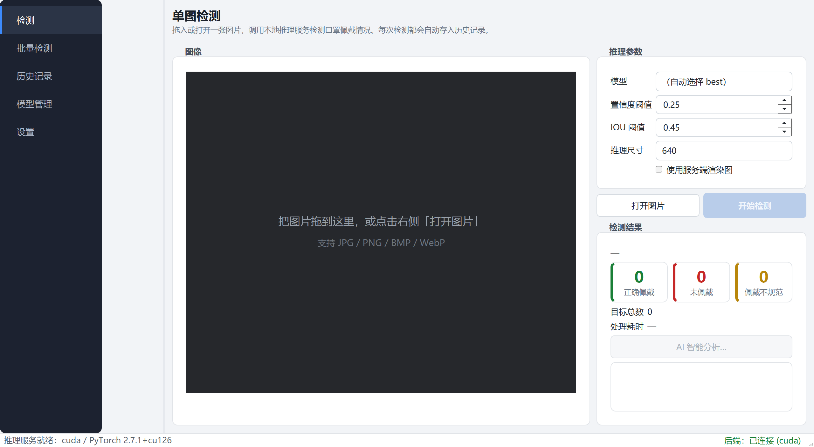
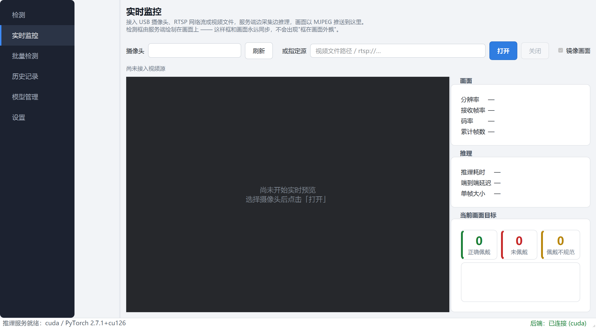
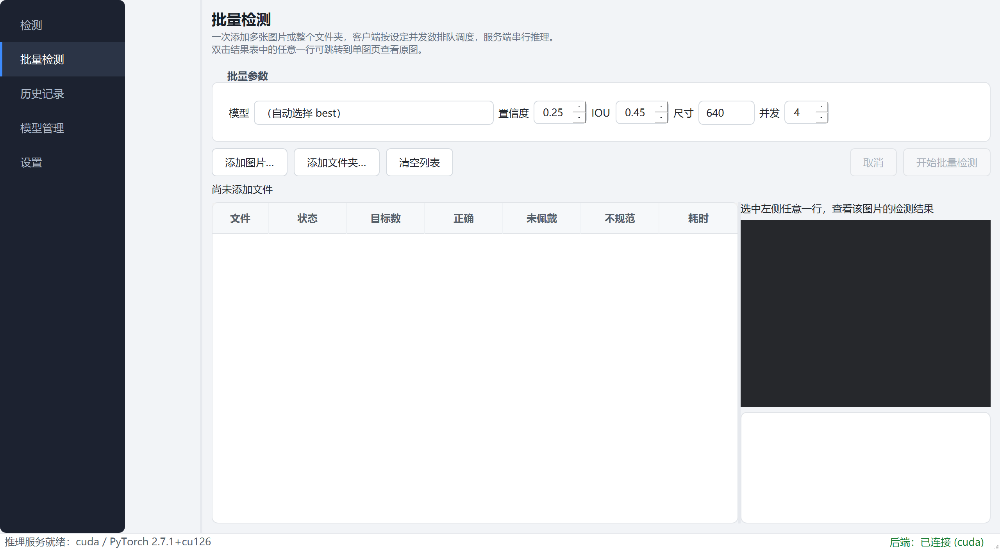
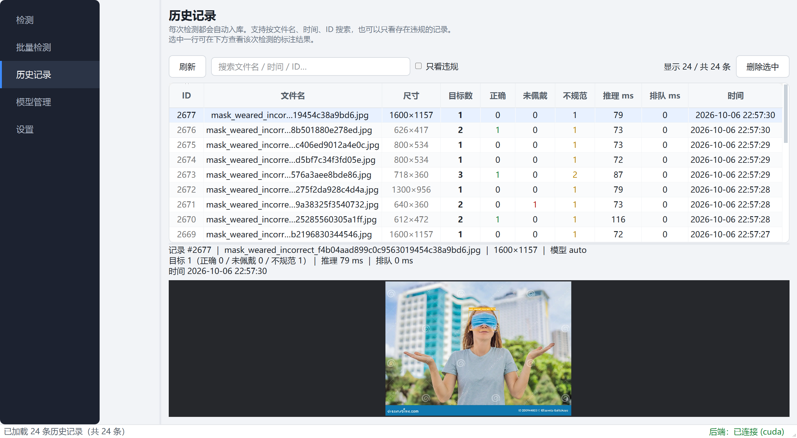
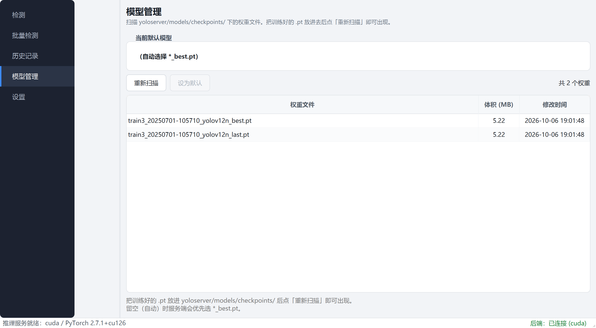
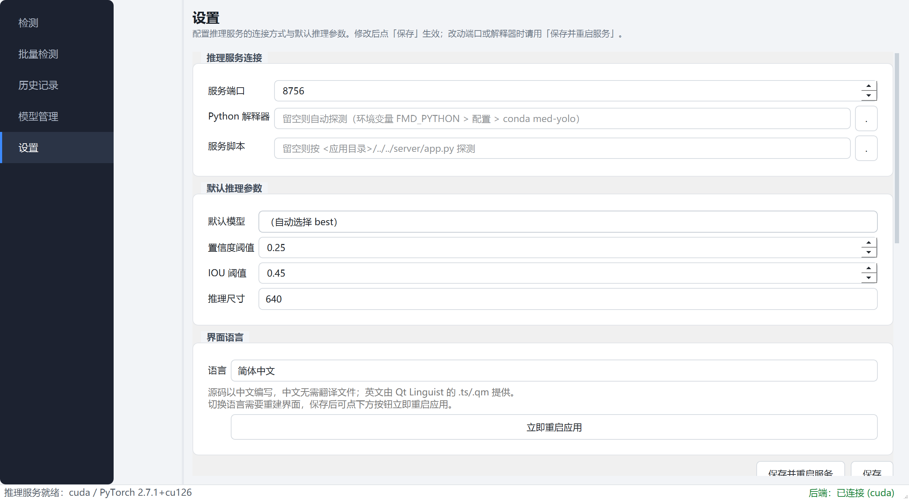

# FaceMaskDetection

**C++/Qt5 上位机客户端 + Python 推理服务** 的口罩佩戴检测桌面系统。

客户端负责交互、渲染与任务调度，服务端只负责推理与数据 —— 两侧以 HTTP/JSON 通信，进程隔离。



---

## 功能

| 能力 | 说明 |
|---|---|
| **单图检测** | 拖拽或打开图片，检测 `with_mask` / `without_mask` / `mask_weared_incorrect` 三类目标 |
| **批量检测** | 多选或整个文件夹入队，客户端按并发数排队调度，服务端串行推理；支持进度、取消、逐张结果预览 |
| **历史记录** | 每次检测自动入库，支持按文件名/时间/ID 搜索、只看违规、查看标注结果、删除 |
| **模型管理** | 扫描权重目录，展示体积与修改时间，可设为默认模型 |
| **AI 分析** | 调用大模型对检测结果做合规性分析，**SSE 流式**逐字返回 |
| **实时监控** | 接入 USB 摄像头 / RTSP / 视频文件，MJPEG 推流叠加检测框，实时显示帧率、码率、端到端延迟 |
| **画面镜像** | 默认镜像（桌面惯例，像照镜子）；工业监控可一键关掉，让画面左右与现场一致。镜像由服务端在画 OSD 之前完成，不影响检测结果 |
| **国际化** | 中英双语（Qt Linguist），191 条字符串，中文无需翻译文件 |

## 界面

| 单图检测 | 实时监控 |
|---|---|
|  |  |

| 批量检测 | 历史记录 |
|---|---|
|  |  |

| 模型管理 | 设置 |
|---|---|
|  |  |

---

## 架构

```
┌──────────────────────────────────┐          ┌──────────────────────────────────┐
│   C++17 / Qt 5.15 客户端          │          │   Python 推理服务                 │
│                                  │   HTTP   │   （仅标准库，零第三方依赖）        │
│  ├─ QProcess        进程守护      │ <──────> │                                  │
│  │                   崩溃自动重启  │  JSON    │  ├─ http.server   线程化 HTTP     │
│  ├─ QNetworkAccessManager 异步网络│  SSE     │  ├─ ultralytics   YOLOv12n 推理   │
│  ├─ QThreadPool     解码/任务调度 │          │  ├─ sqlite3       历史库          │
│  ├─ QGraphicsView   检测框自绘    │          │  └─ SiliconFlow   大模型分析      │
│  ├─ QAbstractTableModel 历史表格  │          │                                  │
│  └─ ChildProcessJob 作业对象守护  │          │                                  │
└──────────────────────────────────┘          └──────────────────────────────────┘
            约 4700 行 C++                            约 800 行 Python
```

**分工原则**：服务端刻意保持"薄"—— 一个职责，把图片变成结构化检测结果。所有交互、渲染、并发调度都在客户端，因此界面永远不阻塞。

## 技术栈

**客户端（本项目的重点）**

| 技术点 | 用在哪 |
|---|---|
| C++17 / Qt 5.15 Widgets | 全部界面 |
| **QProcess + Windows 作业对象** | 拉起并守护推理服务；客户端被强杀时后端不会变成孤儿进程 |
| **QNetworkAccessManager** | 全异步 HTTP，请求超时、错误分类、大图上传 |
| **SSE 增量解析** | 大模型流式输出，处理 TCP 半帧/粘包（`SseParser`，有独立单元测试） |
| **QThreadPool / QRunnable** | 图片解码放后台线程；批量任务队列 |
| **两级背压调度** | 预读上限 + 在途请求上限，避免一次性压爆服务端 |
| **QAbstractTableModel + QSortFilterProxyModel** | 历史记录表格，筛选逻辑与数据解耦 |
| **QGraphicsView + 自定义 QGraphicsItem** | 检测框自绘：矢量、可缩放、悬停显示置信度 |
| Qt Linguist | 中英双语 |
| CMake + MSBuild | 构建（为什么不用 Ninja 见下） |

**服务端**：Python 3.12 · ultralytics 8.3 · PyTorch 2.7 (CUDA) · SQLite · http.server

> **运行期数据**：历史库与上传原图都在 `data/`（已 gitignore）。原图默认保留 30 天、
> 总量上限 2 GB，服务启动时按策略清理（可用 `FMD_UPLOAD_RETENTION_DAYS` /
> `FMD_UPLOAD_MAX_MB` 覆盖）。只清原图，不删检测记录 —— 统计数据不受影响。

**模型**：YOLOv12n，3 类，约 5.2 MB

---

## 快速开始

### 环境要求

| 组件 | 版本 |
|---|---|
| Qt | 5.15.2 `msvc2019_64` |
| 编译器 | MSVC 2022 |
| CMake | ≥ 3.16 |
| Python | 3.12（需 torch + ultralytics，建议独立 conda 环境） |

### 构建并运行

```bat
cd client
build.bat            REM vcvars64 → CMake → MSBuild → windeployqt 部署 Qt 运行时
build\bin\fmd_client.exe
```

客户端启动时会自动拉起 `server/app.py` 并轮询健康检查，服务崩溃会自动重启。Python 解释器与端口可在「设置」页修改。

### 打包发布

```bat
cd client
deploy.bat           REM 产物在 dist\，可直接拷到其它机器运行
```

---

## 性能

同一张 1300×956 图片、同样参数，各跑 4 次取平均：

| 方案 | 端到端耗时 | 响应体积 |
|---|---|---|
| 服务端渲染 PNG + base64 回传 | 608 ms | 1565 KB |
| **客户端自绘（只回结构化 JSON）** | **213 ms** | **约 2 KB** |

**快 2.9 倍，体积小约 800 倍。** 两种模式都保留在界面上（「使用服务端渲染图」开关），可当场对比。

其他实测数据（冷启动 13.7 s 的构成、批量并发、推理尺寸影响）见 **[docs/BENCHMARK.md](docs/BENCHMARK.md)**。

---

## 设计说明

**[docs/ARCHITECTURE.md](docs/ARCHITECTURE.md)** 记录了每项设计决策的**理由与代价**，包括：

- 为什么拆成两个进程，而不是用 pybind11 把 Python 嵌进 C++
- 为什么检测框由客户端画（有实测数据支撑）
- 批量并发为什么限制的是"在途请求数"而不是线程数
- 服务端为什么必须给推理加锁（一个真实 bug：并发时 6 张图挂 3 张）
- **构建系统为什么放弃 Ninja 改用 MSBuild** —— 中文区域 MSVC 下 `msvc_deps_prefix` 编码错乱，导致头文件依赖追踪整体失效，表现为"改头文件不重编、程序莫名崩溃"
- **原图为什么要设保留策略** —— 每检测一次存一份原图，无上限时几千次就能撑到 GB 级；以及为什么清理必须放后台线程
- **视频采集为什么用 latest-frame-wins 而不是队列** —— 排队会让延迟持续累积，实时系统宁可掉帧不要延迟

实时检测的完整规划见 **[docs/ROADMAP.md](docs/ROADMAP.md)**（含实测的性能预算与阶段划分）。

## 项目结构

```
FaceMaskDetection/
├── client/                     【产品】C++17 / Qt5 上位机客户端
├── server/                     【产品】Python 推理服务（仅标准库）
├── yoloserver/                 【资产】模型权重与训练/转换工具链
├── crawler_script/             【工具】数据集爬取
├── docs/                       【文档】架构、性能、计划、截图
└── data/                       【运行期】历史库与原图（已 gitignore）
```

### client/ —— Qt 客户端

界面、渲染、任务调度都在这里。**唯一与用户交互的部分。**

```
client/
├── src/
│   ├── core/                   与界面无关的基础设施（可单独测试）
│   │   ├── Protocol.*          数据契约：所有 JSON 解析集中于此，界面层不碰 QJsonObject
│   │   ├── BackendClient.*     异步网络层：全部请求非阻塞，结果通过信号回传
│   │   ├── BackendProcess.*    QProcess 守护：拉起服务、崩溃自动重启、日志转发
│   │   ├── ChildProcessJob.*   Windows 作业对象：客户端被强杀时后端不会变孤儿
│   │   ├── SseParser.*         SSE 增量解析（大模型流式输出）
│   │   └── MjpegParser.*       MJPEG 增量解析（实时画面）
│   ├── models/                 历史表格的数据层
│   │   ├── HistoryModel.*      QAbstractTableModel：数据与视图解耦
│   │   └── HistoryProxy.*      QSortFilterProxyModel：关键词与"只看违规"筛选
│   ├── workers/                后台任务
│   │   ├── ImageLoaderTask.*   QRunnable：大图解码不阻塞界面
│   │   └── BatchController.*   批量调度：两级背压（预读上限 + 在途请求上限）
│   ├── views/                  六个页面与自绘图元
│   │   ├── DetectView.*        单图检测
│   │   ├── LiveView.*          实时监控（摄像头 / RTSP / 视频文件）
│   │   ├── BatchView.*         批量检测（含逐行结果预览）
│   │   ├── HistoryView.*       历史记录（含标注结果回看）
│   │   ├── ModelsView.*        模型管理
│   │   ├── SettingsView.*      设置（含后端诊断面板）
│   │   ├── ImageCanvas.*       QGraphicsView 画布：缩放、平移、悬停
│   │   ├── DetectionItem.*     自定义 QGraphicsItem：一个图元画框+标签+文字
│   │   ├── VideoWidget.*       实时画面显示（只画最新一帧，不做交互）
│   │   └── LlmAnalysisDialog.* AI 分析结果展示
│   ├── widgets/                可复用的小组件
│   │   ├── PageHeader.*        页面标题 + 说明，给界面建立层次
│   │   └── StatCard.*          统计数字卡片（大号数字 + 语义色条）
│   └── main.cpp                入口 + 全部无界面验证模式（--selftest / --smoke-* 等）
├── resources/
│   ├── style.qss               主题样式表（编译进可执行文件）
│   ├── resources.qrc           Qt 资源清单
│   └── i18n/                   中英翻译（Qt Linguist 的 .ts）
├── tests/                      Qt Test 单元测试（SseParser / MjpegParser，31 项）
├── CMakeLists.txt              构建定义（含 windeployqt 部署 Qt 运行时）
├── build.bat                   一键构建：vcvars64 → CMake → MSBuild → 部署
├── deploy.bat                  打包到 dist/，并校验 Qt DLL 来源
└── README.md                   客户端的详细说明与故障排查
```

### server/ —— Python 推理服务

刻意保持"薄"：只做推理与数据，不做界面。约 3000 行，**零第三方依赖**
（`http.server` + `sqlite3` + `cv2`，`requests` 仅在大模型对接时需要）。

```
server/
├── app.py                      HTTP 路由与服务入口（唯一的对外接口层）
├── detector.py                 YOLO 推理内核：模型加载/缓存、单张与批量推理
├── batching.py                 推理微批处理：把并发请求聚成一批摊薄框架开销
├── camera.py                   视频源抽象：采集线程、latest-frame-wins、断流重连
├── live.py                     实时管线：采集 → 推理 → 画框 → JPEG
├── storage.py                  持久化：SQLite 历史库、原图后台写盘、保留策略
├── llm.py                      大模型分析客户端（无 API key 时走 mock 模式）
└── tools/                      独立小工具（不参与服务运行）
    ├── make_test_video.py      从已爬图片合成测试视频（虚拟摄像头源）
    ├── test_camera.py          视频源模块验证（15 项断言）
    └── preview.py              浏览器实时预览（验证用，不是产品形态）
```

### yoloserver/ —— 模型资产与工具链

本项目**不涉及训练**。这里的模型来自早先的协作项目，定位是
"让训练好的模型在工业现场跑得稳"。

```
yoloserver/
├── models/
│   ├── checkpoints/            训练好的权重（服务端默认从这里加载）
│   └── pretrained/             YOLO 官方预训练权重（转换/对比用）
├── scripts/                    训练、验证、格式转换等命令行工具
├── utils/                      工具脚本依赖的辅助模块
├── configs/                    数据集与训练配置
├── data/                       数据集（crawled/ 为已爬取的图片）
└── initialize_project.py       初始化目录骨架
```

> **换模型**：把新的 `.pt` 放进 `models/checkpoints/`，在「模型管理」页点「重新扫描」即可。
> 这套架构的价值不在"口罩检测"这个具体任务，而在**可替换模型的工业视觉上位机框架**。

### crawler_script/ —— 数据集爬取

独立于产品的一次性工具，用于收集训练图片。
有单独的 `requirements.txt` —— 它需要的第三方库**不属于服务端依赖**。

### docs/ —— 文档

```
docs/
├── ARCHITECTURE.md             设计决策与理由（含踩过的坑与取舍）
├── BENCHMARK.md                全部实测数据（渲染方案、并发、后端优化）
├── ROADMAP.md                  阶段计划与已完成情况
├── TODO.md                     已知问题与后续方向  ← 想接着做就看这个
├── REFACTOR_PLAN.md            从 Django Web 版改造为桌面端的完整记录
├── screenshots/                界面截图（README 中引用）
└── legacy/                     原协作项目的分工文档（来源凭据，不是产品内容）
```

### data/ —— 运行期数据（不入库）

```
data/
├── history.db                  SQLite 历史库（检测记录）
├── uploads/YYYY/MM/DD/         每次检测的原图，按保留策略自动清理
├── server.log                  服务端日志（客户端异常退出时唯一能留下的线索）
└── test_video/                 合成的测试视频（用 tools/make_test_video.py 生成）
```

整个目录已在 `.gitignore` 中。原图默认保留 30 天 / 上限 2 GB，
可用 `FMD_UPLOAD_RETENTION_DAYS` 与 `FMD_UPLOAD_MAX_MB` 调整。

### 想快速了解这个项目？

| 你的目的 | 看哪里 |
| --- | --- |
| 跑起来看看 | 上面的「快速开始」 |
| 了解设计取舍 | [docs/ARCHITECTURE.md](docs/ARCHITECTURE.md) |
| 看实测数据 | [docs/BENCHMARK.md](docs/BENCHMARK.md) |
| 接着往下做 | [docs/TODO.md](docs/TODO.md) |
| 读客户端代码 | 从 `client/src/core/Protocol.h` 开始 —— 它定义了前后端的数据契约 |
| 读服务端代码 | 从 `server/app.py` 的路由表开始，每个模块都有中文头注释说明职责 |

---

## 测试

所有功能都有**无界面验证入口**，可在无人环境跑（CI / 远程调试）：

```bat
cd client
build\bin\fmd_client.exe --selftest "<图片>"     REM 端到端：拉起服务→健康检查→推理
build\bin\fmd_client.exe --smoke-batch "<目录>" 6  REM 批量调度
build\bin\fmd_client.exe --smoke-history          REM 历史列表→详情→原图
build\bin\fmd_client.exe --check-i18n --lang en_US REM 国际化
build\bin\fmd_client.exe --benchmark "<图片>" 4    REM 性能基准
```

全部通过时退出码为 0。另有 SseParser 单元测试（`cd client/tests && run_tests.bat`），覆盖 TCP 半帧、CRLF、坏帧、逐字节投喂等边界。

## 关于本项目

检测模型与数据来自早先的一个协作项目（原为 Django Web 应用）。当前版本将 Web 端整体替换为 C++/Qt 桌面客户端，并把推理逻辑从 Django 中解耦为独立服务 —— 原 Web 版本保留在 `pre-qt-migration` 标签中。
